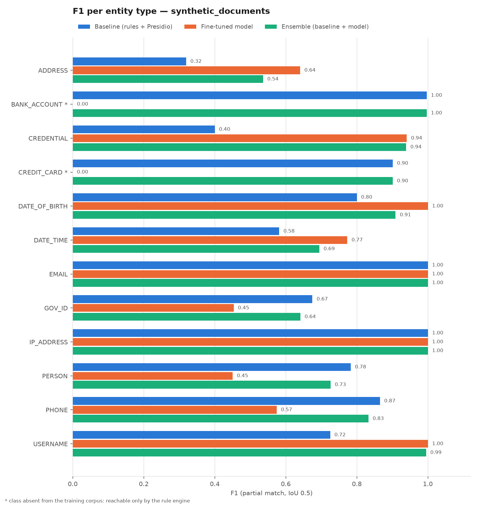
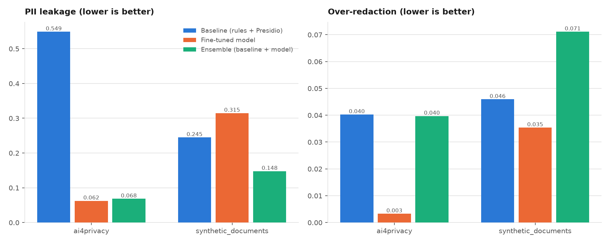
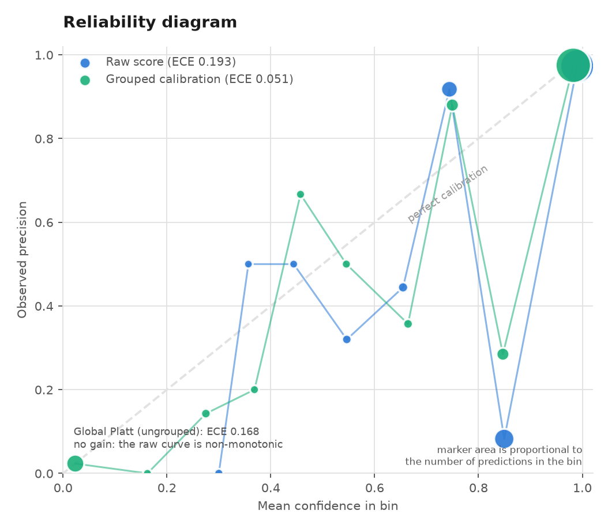
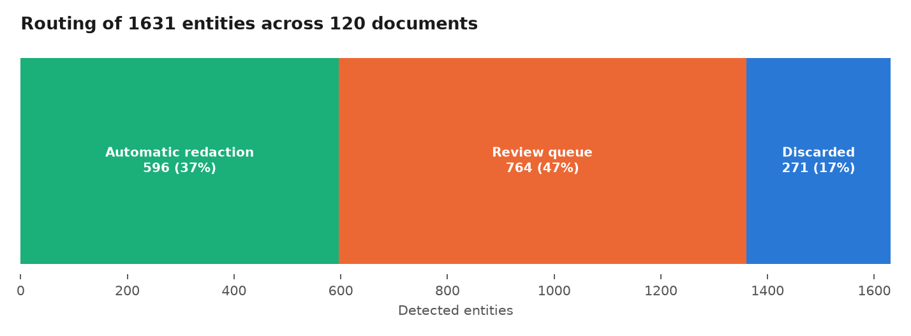

# PII Detection & Redaction Pipeline for Business Documents

[**Live demo**](https://franjcastilloc-pii-detection-redaction--appstreamlit-app-cy5qbr.streamlit.app/) ·
[Model on Hugging Face](https://huggingface.co/FranJCastilloC/distilbert-pii-ner-es-en) ·
[Results](#results)

End-to-end system that takes business documents in **Spanish and English** — invoices, contracts,
emails, support tickets and onboarding forms — detects the personal data (PII) in them,
**redacts** it, assigns a **calibrated confidence score** to every detection, and routes the
ambiguous cases to a **human review queue**.

What separates this from an NER demo is not the model: it is the **calibrated score plus the review
queue**, which turn the precision/recall trade-off into an operational decision instead of a number
in a notebook.

---

## Contents

- [Why this project](#why-this-project)
- [Architecture](#architecture)
- [Data: provenance and why no real PII is used](#data-provenance-and-why-no-real-pii-is-used)
- [Results](#results)
- [How to run it](#how-to-run-it)
- [Repository layout](#repository-layout)
- [Engineering decisions](#engineering-decisions)
- [Limitations](#limitations)

---

## Why this project

Anyone can fine-tune an NER model and report an F1. A redaction system you can actually deploy has
to answer three questions that F1 does not:

1. **How much PII escaped?** (`leakage rate`) — the metric with legal consequences. Recall over
   exact span boundaries is a poor proxy: a span that is 90% covered still leaks.
2. **How much legitimate text was destroyed?** (`over-redaction rate`) — what makes the output
   useless to the business even when privacy is perfect.
3. **What can be automated and what needs a human?** — without calibrated confidence, any threshold
   is arbitrary.

This project measures all three.

---

## Architecture

```
document
    │
    ├─► Rule engine          regex + checksums (Luhn, IBAN mod-97, DNI/NIE, CUIT, NIF, SSN)
    ├─► Presidio + spaCy     statistical NER (en_core_web_md / es_core_news_md)
    └─► Fine-tuned DistilBERT  BIO token classification, 10 classes, sliding window
              │
              ▼
        Fusion (noisy-OR)    agreement → boost · type conflict → penalty + flag
              │
              ▼
        Calibration (Platt)  raw score ──► observed probability of being correct
              │
              ▼
        Routing policy       ≥0.90 automatic │ 0.50–0.90 review │ <0.50 discarded
              │              + business rules (high risk, conflict, failed checksum)
              ▼
    redacted text  +  review queue (SQLite + JSONL)  +  audit JSON
```

### Taxonomy: 12 actionable classes

`PERSON` · `EMAIL` · `PHONE` · `ADDRESS` · `DATE_OF_BIRTH` · `CREDIT_CARD` · `BANK_ACCOUNT` ·
`GOV_ID` · `USERNAME` · `CREDENTIAL` · `IP_ADDRESS` · `DATE_TIME`

The public corpus ships 28 heterogeneous labels. They are collapsed onto these 12 through an
explicit mapping; whatever is dropped (`TITLE`, `SEX`, `COUNTRY`, `CARDISSUER`) is recorded with its
reason in `data/processed/dataset_report.json`, so the decision is auditable rather than a silent
trim.

### Hybrid architecture: a decision forced by the data

Taking inventory of the corpus surfaced a fact that changed the design: **`ai4privacy` contains no
card numbers and no bank account numbers at all.** It only annotates `CARDISSUER` — the brand, 22
occurrences.

Rather than fabricating training signal so the table would look complete:

- The model is trained on the **10 classes that actually exist** in the corpus.
- `CREDIT_CARD` and `BANK_ACCOUNT` are handled by the **rule engine**, which is strictly better for
  these types anyway: Luhn and the IBAN mod-97 checksum are arithmetic proofs, not estimates.

This is not a limitation being hidden. It is the reason the system is hybrid.

### Redaction modes

| Mode | Output | When to use it |
|---|---|---|
| `mask` | `[NAME]`, `[CREDIT_CARD]` | maximum privacy |
| `partial` | `[CREDIT_CARD_****6467]` | human reconciliation of records |
| `pseudonymize` | `[NAME:a3f9c2]` | analytics: the same person maps to the same tag across documents |

The pseudonym is a keyed HMAC-SHA256: deterministic, and reversible only with the secret.

---

## Data: provenance and why no real PII is used

**Principle: no real person's PII enters this project.** Nothing is scraped, no data dumps, no
leaked documents. Two sources, both synthetic:

### 1. `ai4privacy/pii-masking-300k` (Hugging Face)

- **What it is**: a synthetic corpus of ~300k examples with per-entity character offsets.
- **Slice used**: English + Spanish → 177,677 train rows and 47,728 validation rows filtered down to
  61,769 and 15,762 respectively.
- **Why this and not CoNLL-2003**: CoNLL only has PER/LOC/ORG/MISC. It does not cover cards,
  accounts, tax identifiers or dates of birth — precisely the classes a document redaction workflow
  is obliged to remove. CoNLL is cited as the reference NER benchmark, not used as a training source.
- **Why it is safe**: it is generated, not collected. No identifier corresponds to a real person.
- **Character offsets are used**, not the corpus's pre-computed `mbert_bio_labels`, so tokenisation
  stays owned by this project and the same annotations score all three detectors identically.

### 2. Synthetic business documents (Faker, ES/EN)

- **What it is**: 300 complete documents — invoice, contract, email, support ticket, onboarding form
  — in Spanish and English, across the `es_ES`, `es_MX`, `en_US`, `en_GB` locales.
- **Why it is needed**: the public corpus is isolated sentences. Real redaction happens on
  *documents*, where layout, field labels and repeated mentions all matter. This corpus introduces
  deliberate **domain shift**: train on sentences, evaluate on documents.
- **How it is annotated**: the document is assembled through a builder that records the exact offset
  of every PII value **as it is written**. The annotation is exact by construction, with no manual
  labelling. A test asserts no offset ever drifts.
- **Distractors**: every document contains strings that *look* like identifiers but are not PII
  (`ORD-175954`, `SKU-78-2542`, amounts, invoice numbers), left deliberately unannotated. They are
  what makes **over-redaction** honestly measurable.

---

## Results

All figures below are measured and reproducible with `make all`; they live in
`results/metrics/comparison.csv`.

### The fine-tuned model

Multilingual DistilBERT, 15,000 documents, 1 epoch, ~41 min on Apple Silicon (MPS).
Validation (seqeval, entity level):

| | Precision | Recall | F1 |
|---|---|---|---|
| **micro** | 0.9236 | 0.9468 | **0.9350** |

Per type: `EMAIL` 0.984 · `GOV_ID` 0.958 · `ADDRESS` 0.948 · `PHONE` 0.936 · `PERSON` 0.919 · `USERNAME` 0.918 · `DATE_TIME` 0.918 · `DATE_OF_BIRTH` 0.916 · `IP_ADDRESS` 0.909 · `CREDENTIAL` 0.830.

> **An honest note on training.** Two epochs were planned. The end-of-training evaluation exhausted
> the machine's memory (16 GB, 13.5 GB of swap) and the process deadlocked on I/O. The end-of-epoch-1
> checkpoint is promoted instead; its metrics are measured on the held-out 2,000 validation samples.
> A second epoch would probably improve these numbers somewhat.

### Comparison: baseline vs model vs ensemble

F1 with partial match (IoU ≥ 0.5). Both sides — gold and prediction — are normalised by merging
adjacent spans of the same type, because the corpus annotates `GIVENNAME1`/`LASTNAME1` separately and
that would unfairly punish any detector returning the full name as a single span.

**Test set `ai4privacy`** (500 documents — same distribution as training)

| System | P | R | Exact F1 | Partial F1 | PII leakage | Over-redaction | docs/s |
|---|---|---|---|---|---|---|---|
| Rules (regex + checksums) | 0.756 | 0.245 | 0.370 | 0.393 | 0.729 | 0.005 | 4340 |
| Presidio | 0.365 | 0.236 | 0.286 | 0.322 | 0.630 | 0.038 | 24 |
| Baseline (rules + Presidio) | 0.433 | 0.322 | 0.369 | 0.413 | 0.549 | 0.040 | 37 |
| **Fine-tuned model** | 0.919 | 0.923 | **0.921** | **0.952** | 0.062 | 0.003 | 38 |
| Ensemble (baseline + model) | 0.733 | 0.901 | 0.808 | 0.843 | 0.068 | 0.040 | 22 |

**Test set `synthetic_documents`** (250 complete documents — *domain shift*)

| System | P | R | Exact F1 | Partial F1 | PII leakage | Over-redaction | docs/s |
|---|---|---|---|---|---|---|---|
| Rules (regex + checksums) | 0.937 | 0.561 | 0.702 | 0.734 | 0.436 | 0.000 | 1537 |
| Presidio | 0.557 | 0.572 | 0.564 | 0.609 | 0.305 | 0.046 | 30 |
| Baseline (rules + Presidio) | 0.622 | 0.686 | 0.652 | 0.712 | 0.245 | 0.046 | 30 |
| Fine-tuned model | 0.504 | 0.579 | 0.539 | 0.651 | 0.315 | 0.035 | 36 |
| **Ensemble (baseline + model)** | 0.599 | 0.807 | **0.688** | **0.765** | 0.148 | 0.071 | 19 |





### The four results that matter

**1. The model multiplies the baseline's F1 by 2.3 on its own distribution**
(0.952 vs 0.413) and cuts PII leakage from 0.549 to
0.062 — from more than half of all entities escaping, to one in sixteen.

**2. Domain shift is brutal, and it cuts both ways.** Moving from isolated sentences to complete
documents, the model drops from 0.952 to 0.651 while the rule engine
*rises* from 0.393 to 0.734. Formal documents carry explicit field
labels (`Phone:`, `Name:`) that a regex nails and that the training corpus never contained.
**Evaluating in-distribution only would have led to the opposite of the right conclusion.**

**3. There is no single winner, and that is why the system is hybrid.** On complete documents:

| Model wins (model F1 vs baseline) | Rules win (baseline F1 vs model) |
|---|---|
| `CREDENTIAL` 0.94 vs 0.40 | `BANK_ACCOUNT` 1.00 vs 0.00 |
| `ADDRESS` 0.64 vs 0.32 | `CREDIT_CARD` 0.90 vs 0.00 |
| `USERNAME` 1.00 vs 0.72 | `PERSON` 0.78 vs 0.45 |
| `DATE_OF_BIRTH` 1.00 vs 0.80 | `PHONE` 0.87 vs 0.57 |
| `DATE_TIME` 0.77 vs 0.58 | `GOV_ID` 0.67 vs 0.45 |
|  | `EMAIL` 1.00 vs 1.00 |
|  | `IP_ADDRESS` 1.00 vs 1.00 |

The ensemble is the only system that stays near the best score on almost every type, and it is the
one that best serves the actual objective: **leakage 0.148, or
40% below the baseline**, with the best F1
(0.765). The price is over-redaction: 0.071 against
0.046. For a privacy system that is the right side to err on, and the thresholds
are adjustable in the demo.

**4. Calibration only works when it is grouped.**

| | ECE |
|---|---|
| Raw score | 0.1928 |
| Global Platt | 0.1683 |
| **Platt per (detector set, type)** | **0.0508** |



A global Platt fit barely moves the ECE because the reliability curve is **non-monotonic**: Presidio
emits a constant 0.85 for every `PERSON`/`LOCATION` it finds and on this corpus is right **8.7%** of
the time in that bin (it fires on capitalised common nouns, Spanish verbs such as *"Quisiera"*, and
HTML fragments), while a 0.85 from the rule engine is usually correct. No monotonic mapping can fix
both at once. Fitting one curve per (detector set, entity type) cuts ECE by
74% across 19 groups.

Calibration is **applied only where there is evidence**. A group with no fitted curve keeps its raw
score: pushing it through the global fit — dominated by Presidio's false positives — took a
checksum-verified IBAN from 0.75 down to 0.42 and discarded it, leaking the account number.

### The review queue in operation

120 documents, 1631 detected entities:



| Decision | Entities | % |
|---|---|---|
| Automatic redaction | 596 | 36.5% |
| Human review queue | 764 | 46.8% |
| Discarded (logged) | 271 | 16.6% |
| **Values surviving verification** | **0** | **0%** |

A 47% review rate is high, and deliberately so: the default thresholds favour
privacy over saving human effort. The demo lets you move them and watch the effect live.

### Throughput

The rule engine processes ~1537 documents/s; the full ensemble ~19
docs/s on a laptop CPU/MPS. Enough for an overnight batch of tens of thousands of documents without a GPU.

### A real example

`results/examples/` holds an input/output pair and its audit JSON for each of the 5 document types in
both languages. Verbatim pipeline output (onboarding form, ES):

```
Referencia interna: ORD-517225              →  Referencia interna: [DIRECCION]-[DIRECCION]
Nombre y apellidos: Raquel Ferrández        →  Nombre y apellidos: [NOMBRE]
Fecha de nacimiento: 04/12/1985             →  Fecha de nacimiento: [FECHA_NACIMIENTO]
Documento de identidad: 26670364R           →  Documento de identidad: [IDENTIFICACION]
Teléfono móvil: +34 942 51 23 30            →  Teléfono móvil: [TELEFONO]
Cuenta para domiciliación: ES34787200974... →  Cuenta para domiciliación: [CUENTA_BANCARIA]
Usuario deseado: rferrández46               →  Usuario deseado: [USUARIO]
Contraseña provisional: _(z6mUyOwz0k        →  Contraseña provisional: [CREDENCIAL]
```

Every piece of PII is gone. The first line shows the failure that remains: `ORD-517225` is a
distractor — an internal reference, not PII — that Presidio tags as a location and the pipeline
over-redacts. It lands in the review queue with its reason attached, which is exactly what the queue
is for. (Redaction markers follow the document's own language, so a Spanish document gets Spanish
markers.)

---

## How to run it

### Requirements

`requirements.txt` holds what inference needs; `requirements-dev.txt` adds
training, evaluation, reporting and notebooks. Python 3.11 and
[`uv`](https://github.com/astral-sh/uv). Tested on macOS (Apple Silicon, MPS); runs
the same on CPU or CUDA.

### Install

```bash
cd 01-pii-detection-redaction-pipeline
make setup
```

This creates `.venv`, installs the pinned `requirements.txt`, and downloads the spaCy models
Presidio needs.

### Full pipeline

```bash
make all
```

Equivalent to, in order:

| Command | What it does | Approx. time |
|---|---|---|
| `make data` | Download the corpus, build the splits, generate synthetic documents | ~3 min |
| `make train` | Fine-tune multilingual DistilBERT | ~40 min (MPS) |
| `make calibrate` | Fit the confidence calibrator on validation | ~3 min |
| `make evaluate` | Compare the 5 systems across both test sets | ~2 min |
| `make examples` | Run the pipeline and save examples + review queue | ~2 min |
| `make report` | Generate tables and figures under `results/` | ~5 s |
| `make test` | pytest suite | ~1 s |

### Interactive demo

A hosted instance runs at
[franjcastilloc-pii-detection-redaction.streamlit.app](https://franjcastilloc-pii-detection-redaction--appstreamlit-app-cy5qbr.streamlit.app/).
It pulls the fine-tuned weights from the Hugging Face Hub, since they are too
large for git, and runs the small spaCy models to stay inside its memory budget.

To run it locally:

```bash
make app
```

Opens Streamlit at `http://localhost:8501`. Each project under `Proyectos_Do_it` owns a fixed port
(01 → 8501, 02 → 8502, 03 → 8503) so their demos can run side by side; override with
`make app PORT=xxxx`. Paste or upload a document, pick the engine
(rules / baseline / ensemble) and the redaction mode, **move the queue thresholds live**, and see
side by side the original highlighted by entity type and the redacted output, the entity table with
score and decision, and the review queue with the reason behind each case.

### As a library

```python
from pii_pipeline.pipeline import PIIPipeline

pipeline = PIIPipeline()                       # rules + Presidio + model
result = pipeline.process(text, mode="mask")

result.redacted_text     # redacted output
result.entities          # entities with calibrated score and decision
result.review_items      # what needs a human, with the reason
result.leaks             # verification: must be empty
result.audit_log()       # full serialisable trace
```

---

## Repository layout

```
01-pii-detection-redaction-pipeline/
├── README.md
├── Makefile                     # make setup | data | train | evaluate | app | all
├── requirements.txt             # pinned versions from the verified environment
├── config/config.yaml           # documented thresholds and paths
├── src/pii_pipeline/
│   ├── entities.py              # taxonomy, label mapping, markers, risk tiers
│   ├── detectors/
│   │   ├── base.py              # Detector protocol + span algebra
│   │   ├── validators.py        # Luhn, IBAN mod-97, DNI/NIE, CUIT, NIF, SSN
│   │   ├── regex_rules.py       # rule baseline with context windows and checksums
│   │   ├── presidio_detector.py # Presidio + multilingual spaCy
│   │   └── transformer_detector.py
│   ├── training.py              # offset→BIO alignment, sliding window, Trainer
│   ├── scoring.py               # noisy-OR fusion, grouped Platt scaling, ECE
│   ├── redaction.py             # 3 modes + no-leakage verification
│   ├── review_queue.py          # routing policy + SQLite/JSONL persistence
│   ├── pipeline.py              # orchestrator
│   ├── data/                    # download, split building, Faker generator
│   └── evaluation/              # span-level metrics, leakage, over-redaction
├── scripts/                     # 01_build_data … 06_examples
├── notebooks/                   # exploration · training · evaluation
├── app/streamlit_app.py
├── tests/                       # 45 tests
├── data/synthetic/              # document corpus (tracked)
└── results/                     # metrics/ · figures/ · examples/
```

---

## Engineering decisions

Five decisions that came out of real failures during development, not from the plan:

**1. A valid checksum wins every overlap conflict.**
The first version resolved overlaps by type priority. Result: inside
`ES91 2100 0418 4502 0005 1332`, a run of digits matched the credit-card pattern, failed Luhn, and
still beat the verified IBAN — leaking the account number. The tie-break order is now
`(checksum, score, priority, length)`, pinned by a test.

**2. No entity crosses a line break (except addresses).**
spaCy's statistical NER routinely extended a `PERSON` span through a newline into the next field's
label. Redacting that deleted the label along with the name and destroyed the document structure.
Fixed once in the normalisation shared by all three detectors.

**3. "Date of birth" context does not jump lines.**
A 45-character context window let `Issue date:` inherit the meaning of the line above and be tagged
`DATE_OF_BIRTH`. Business documents are line-oriented; the window now respects that.

**4. Calibration only applies where there is evidence.**
A group with no fitted curve keeps its raw score. Pushing it through the global fit — which is
dominated by Presidio's false positives — took a checksum-verified IBAN from 0.75 down to 0.42 and
discarded it, leaking the account number. A passing checksum now also blocks discarding outright.

**5. Size the training run to the hardware you have.**
The first run (40,000 documents, batch 32, 3 epochs) drove a 16 GB laptop to 12 GB of swap and
deadlocked on I/O. Three fixes: `Dataset.from_generator` instead of materialising every window,
`preprocess_logits_for_metrics` doing the `argmax` on device (~84× less memory at evaluation), and a
dataset sized to the real budget. From ~0.4 it/s while thrashing to ~1.4 it/s steady.

**No-leakage verification as the last line of defence.** After redacting, the pipeline checks that no
detected value survives verbatim in the output. An off-by-one in span handling would otherwise ship a
document that *looks* redacted and is not. It caught two real classes of bug: the same value scored
inconsistently across two mentions, and a value detected in one place but not in its repeat.

---

## Limitations

- **`CREDIT_CARD` and `BANK_ACCOUNT` depend on the rule engine**, because the corpus does not contain
  them. This covers checksum-bearing formats (cards, IBAN) but not arbitrary local account numbering
  without a check digit.
- **Spanish and English only.** The base model is multilingual and the architecture does not change
  to add languages, but the rules and the reported metrics cover these two.
- **Plain-text input.** No PDF extraction or OCR; the pipeline starts where a text extractor ends.
- **Evaluation is on synthetic data.** That is a deliberate privacy decision, but it means the
  numbers are an optimistic upper bound against real documents, which bring OCR noise, abbreviations
  and inconsistent layout.
- **The review queue is a simulated workflow.** It persists, routes and resolves cases, but there is
  no authentication, reviewer assignment or SLA.

---

## Licence and data

Code under MIT. The `ai4privacy/pii-masking-300k` corpus keeps its own licence on Hugging Face. The
synthetic documents generated in this repository are public domain: they correspond to no real
person.
